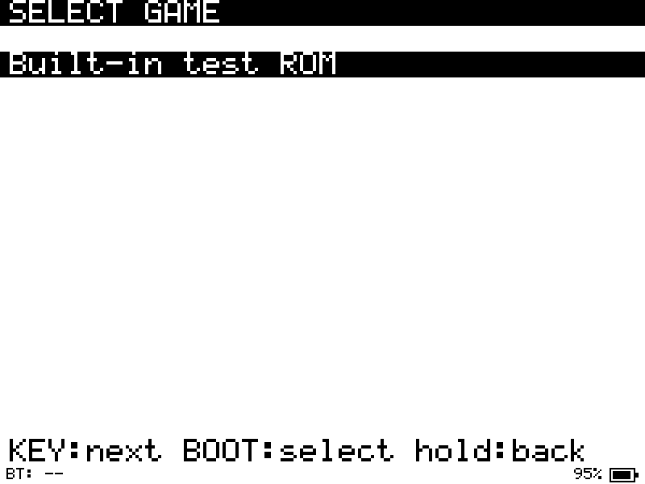

# Game Boy emulator — Waveshare ESP32-S3-RLCD-4.2

A port of [zephray/paperboy](https://gitlab.com/zephray/paperboy) (a CrankBoy /
Peanut-GB Game Boy emulator written for the M5PaperS3 e-paper) to the Waveshare
ESP32-S3-RLCD-4.2, plus a Bluetooth gamepad so the device has a full set of
controls.

DMG and CGB cartridges both run — the video mode can be switched between the two
cores from the pause menu — on the panel's fixed four shades, since a reflective
1-bit LCD has no colour to give. See [Video modes](#video-modes).

It is an ESP-IDF project and sits alongside the Arduino `dino_rlcd/` sketch in
this repository; the two share the vendored `codec_board` + `esp_codec_dev`
components but are otherwise independent.



## What runs where

| Piece | Origin |
| --- | --- |
| Game Boy core | PaperBoy's CrankBoy build of Peanut-GB, vendored unmodified (`main/crankboy_core/`), DMG and CGB interpreters both used |
| APU | PaperBoy's minigb_apu, with the sample rate retuned (`main/minigb_apu/`) |
| Audio engine dispatcher, profiler, state/save handling | PaperBoy, adapted |
| Menus, ROM picker, notices | PaperBoy's `ui.c`, re-targeted to this panel |
| HID report descriptor parser, BLE HID host, panel driver, audio backend | Written for this port |

MIT throughout: `peanut_gb.h` © Mahyar Koshkouei, minigb_apu MIT, PaperBoy's
`msg`/`ui` © Wenting Zhang. PaperBoy pinned at `e70b293`.

## Hardware

ESP32-S3-WROOM-1-N16R8: 16 MB flash, 8 MB OPI PSRAM, **Bluetooth 5 LE only —
no BR/EDR**. That last point matters and is explained under *Bluetooth*.

| Function | Pins |
| --- | --- |
| RLCD (SPI2) | SCLK 11, MOSI 12, CS 40, DC 5, RST 41 — 24 MHz, mode 0 |
| TF card (SDMMC, 1-bit) | CLK 38, CMD 21, D0 39, internal pull-ups |
| ES8311 codec | I2S MCLK 16, BCLK 9, WS 45, DOUT 10; I2C SDA 13, SCL 14; PA 46 |
| Buttons | KEY = GPIO18, BOOT = GPIO0, active low |
| Battery | ADC1 channel 3 = GPIO4, behind a 100k/200k divider (×3) |

## Display

The ST7305 is **1 bit per pixel with no greyscale**, and Game Boy art has four
shades, so the picture is 2× scaled and dithered:

* The Game Boy's 160×144 becomes **320×288** at (40, 0); the bottom 12 px are a
  status strip (Bluetooth state left, battery right).
* Each Game Boy pixel becomes a **2×2 block** whose ordered pattern encodes the
  original shade — all paper, one sub-pixel, two (on a diagonal), or all ink.
* The panel is natively portrait and is used rotated 90°, mapping landscape
  (x, y) to panel (col 299−y, row x). That is the same orientation `dino_rlcd`
  gets from `U8G2_R1`, derived from u8g2's `draw_l90_r1`.
* A set framebuffer bit is paper and a clear bit is ink. Waveshare's reference
  driver transmits the opposite, which is why their own U8g2 demo renders
  light-on-dark; `dino_rlcd` flips it, and so does this driver.

Panel RAM is addressed as 25 column groups of 12 pixels by 50 bands of 8 rows,
with two rows packed per address unit and `0x2A` written end-first. A flush
opens one column window and one full-height row window, then streams the whole
column-group range in a single `0x2C` write.

Two knobs in `config.h` trade speed against how conservative the driver is:

| | |
| --- | --- |
| `RLCD_SPI_HZ` | 40 MHz. Waveshare's reference driver and `dino_rlcd` both use 24 MHz; this is pushed higher because the flush sits on every frame's critical path. Drop it back if the panel ever shows artefacts. |
| `RLCD_ONE_WINDOW` | 1 = one row window and a single payload write. 0 = re-arm the row window for each of the 50 bands, which is what Waveshare's driver does. The fast path relies on the panel auto-incrementing its row address across the whole 200-row-unit window. |

Measured on this board with the console's `F` command, which times one full
repaint: **5.85 ms** total, of which **2.72 ms** is repacking the dithered
framebuffer into the panel's 12-column-group format and **3.13 ms** is shifting
15000 bytes out over SPI (40 MHz would be 3.0 ms in theory, so the link is
running at the configured speed). At the original 24 MHz the transfer alone cost
~5.2 ms, which is where the earlier 8.6 ms figure came from. A one-group flush
costs 0.48 ms.

**Only changed column groups are redrawn.** Game Boy scanlines map onto panel
columns, so a flush costs roughly 0.28 ms per 6-scanline strip that changed and
nothing at all for a static screen (the console reports `groups=0`). A moving
sprite touches only the strips it occupies — a few tenths of a millisecond —
while a scrolling screen genuinely changes every strip and costs a full repaint
of 7 ms.

The status strip is the bottom 12 framebuffer rows, which is exactly panel
column group 0, so it is refreshed independently and only when its content
actually changes. It is never folded into the picture's flush, which would
otherwise widen a small sprite update into a full-screen repaint once a second.

## Controls

| | |
| --- | --- |
| KEY | Game Boy **A** |
| BOOT | Game Boy **B** |
| Hold both ~0.8 s | open the pause menu |
| In menus | KEY steps through the entries (wrapping at the end), BOOT picks one and leaves the cursor there, hold both ~0.8 s to go back a level |
| Gamepad | D-pad or left stick → D-pad; A/Y → **B**; B/X → **A**; LB/RB → B/A; Select → Select; Start → Start; **Start+Select together → pause menu** |

Menus are always navigable with the two physical buttons, so the device is never
locked out if a gamepad is absent or unpaired. While both buttons are held down
their individual meanings are suppressed, so reaching for the "back" gesture does
not first step the cursor and activate whatever it lands on.

The chord that opens the pause menu belongs to the menu and not to the game: its
buttons stay swallowed until they are released, whatever happens in between. So
resuming does not hand the game a held A+B, or a held Start+Select — which most
titles read as "open the map", the reason this exists. Swallowing is armed only
by a chord that actually opened the menu, so holding both buttons during play
still behaves as A+B and nothing else changes.

### Pause menu

Opened with the chord (or the pad's Guide button) while a game is running. The
right-hand column shows the current state of each setting.

| Item | |
| --- | --- |
| Resume | back to the game |
| Save state / Load state | choose one of four slots, written beside the ROM as `<rom>.st1` … `.st4` |
| Sound: toggle | mute, without stopping the emulation |
| Volume down / up | 5% steps, stored in the config file |
| Video mode | switch between the **DMG** and **CGB** cores (see below) |
| Bluetooth | scan, pair, forget |
| Reset game | restart the cart with its battery save, like a power cycle |
| Change game | save and return to the ROM picker |

**To quit a game, open the pause menu and choose *Change game*.** Both the
cartridge's battery RAM and a snapshot are written on the way out, and opening
that ROM again offers *Resume* or *New game*.

### Video modes

The core ships two interpreters, one compiled for a DMG and one for a CGB, and
*Video mode* chooses between them. The badge shows the mode the machine is
**actually** running in, which is not always the setting: a plain DMG cartridge
always runs on the DMG core, and a snapshot taken in the other mode restores its
own mode with it.

| | |
| --- | --- |
| **CGB** (default) | colour cartridges get the CGB core: WRAM/VRAM banking, per-tile attributes, HDMA and double-speed. DMG cartridges are unaffected. |
| **DMG** | everything runs as a monochrome DMG. Colour-enhanced carts keep working, drawn the way a DMG would draw them — useful for the handful of games whose colour-first rendering breaks that way. |

Switching restarts the cartridge, because the core only reads the mode when it
initialises. The cartridge's battery save carries over; the snapshot is left
alone and is simply not restored across a mode change. A cartridge whose header
asks for colour *only* offers to switch when the DMG core is selected, since
running it as a DMG draws garbage rather than reporting an error.

**Colour is approximated, not emulated.** This core implements the CGB's
hardware but not its colour: the palette registers (`0xFF68`–`0xFF6B`) are
discarded, so a game's eight palettes all collapse onto the same four shades,
with colour index 0 as the lightest and 3 the darkest. Scenes keep their
shapes, contrast and legibility; they do not keep their hues.

### Bluetooth

The ESP32-S3 has **no classic Bluetooth (BR/EDR) radio**, so only BLE HID
(HOGP) pads can be used: Xbox Series X|S, DualSense/DualShock 4, Switch Pro,
8BitDo pads in BLE mode, and generic BLE gamepads. A pad that speaks only
classic Bluetooth cannot be made to work by any firmware change.

Some pads are dual-mode and only speak BLE in one position. The ShanWan Q36
used here does exactly that: its **X position is classic Bluetooth** (macOS
shows `HID ACL` and a MAC address) while its **D / Android position is BLE**
(`HID BLE`, and it advertises the `0x1812` HID service the board looks for).
If a pad does not appear, try its other mode before concluding anything.

To check a pad before pairing, scan with the host's own Bluetooth stack, which
is independent of the board:

```sh
pip install bleak
python3 gameboy_rlcd/tools/ble_scan.py 45
```

Put the pad in pairing mode while it runs. A BLE pad must advertise — that is
what pairing is — so if the pad's LED is blinking and it never appears, it is
not advertising over BLE. Anything carrying the HID service (`0x1812`) is
printed with an arrow; that is exactly what the board looks for.

Pairing is driven from the pause menu's *Bluetooth* entry: it scans for five
seconds, lists what it finds, connects, and remembers the pad in NVS for
automatic reconnection on the next boot. *Forget gamepad* drops the bond.

Rather than hard-coding per-model button maps, the pad's **HID report descriptor
is parsed at connect time** and the button, hat-switch and axis bit offsets are
read out of it. HID leaves button *ordering* up to the device, though, so a
small table picks the button indices by the vendor and product ids the pad
reports, falling back to the Xbox layout:

| Pad | A | B | X | Y | LB | RB | Select | Start |
| --- | --- | --- | --- | --- | --- | --- | --- | --- |
| Amazon Fire TV (`1949:0402`, i.e. the Q36 in Android mode) | 0 | 1 | 3 | 4 | 6 | 7 | 11 | 10 |
| Xbox (`045e:02fd`), default | 0 | 1 | 2 | 3 | 4 | 5 | 6 | 7 |

The face buttons deliberately drive the opposite Game Boy button to their own
label: A and Y act as B, B and X act as A. The pairs are what matters, so pads
whose face buttons are labelled differently still play. Pads that present the
D-pad as a hat switch, as buttons, or only as a left stick are all handled.
`console` command `i` prints the mapping the active profile produces, and `p`
logs every input report that changes, which is how an unknown pad's layout gets
worked out.

The Q36's remaining button indices (2, 5, 8, 9, 12-15) were never observed, so
its profile claims no guide button and the menu is opened with **Start+Select**,
which uses only verified indices. A guide index is only listed for a profile
that has actually been seen to send one.

### Button mapping

The table above is only a default. Pause menu → *Bluetooth* → **Button mapping**
lists the Game Boy's own buttons and shows which pad button plays each:

```
KEY MAPPING
  A                    Pad B
  B                    Pad A
  Start                Start
  Select               Select
  Up                   hat
  ...
  Menu                 not set
  Reset this pad
```

Select a row and press the pad button you want to play it. The index is learnt
from the pad itself, so a pad whose buttons report in an unexpected order can be
corrected without touching the firmware, and that is how an index gets
established for a pad nobody has seen before.

The defaults suit the hands rather than the labels: the pad's A plays the Game
Boy's B and its B plays the Game Boy's A, which is why the first two rows read
the way they do. Anyone who would rather have the labels agree can assign both
rows by hand — there is no mode, profile or alias to reason about.

`Menu` is the pad's middle button, the one with a house or Xbox logo; the HID
name for it is "guide", which is not what anybody calls it while holding the
thing. While `Menu` is unset the pause menu still opens by pressing
**Start+Select** together, so a pad without such a button is not locked out.

A direction shows `hat` when the pad reports its D-pad as a hat switch: there is
nothing to assign, because the direction handling picks it up by itself.
Assigning a button to a direction overrides the hat for that direction only,
leaving the other three alone.

On the capture screen, `KEY` alone clears the assignment and both buttons held
cancel; nothing pressed for 15 s returns to the list. The buttons that opened the
capture stay swallowed until released, so binding a direction cannot walk the
cursor across the page underneath.

Assignments are stored per pad *model* — by the vendor and product ids, the same
key the default table uses — as a `padmap=` line in `/sdcard/gameboy.cfg`, and
are laid over the built-in table rather than replacing it. A line this build
cannot read, such as one written when the set of buttons was different, is
ignored in favour of the built-in table rather than half-applied. *Reset this
pad* drops the assignment outright. The Q36's two modes have different ids, so a
mapping learnt in one cannot corrupt the other.

Pads that report only *changed* bytes rather than the whole button field will not
capture cleanly, since the page compares each decoded report against the last.
The Q36 sends full reports.

### When the pad connects but nothing responds

Check the pad before the firmware. A dual-mode pad that has slipped into its
keyboard or media mode still connects, still lights up and still sends reports —
but they are consumer-control reports, which carry no buttons by definition, so
nothing on this side can tell that apart from a pad with dead buttons.

The device now says so rather than leaving it to guesswork. In the status line,
`rx=<reports>/<with-buttons>`: if the first number climbs while you press and the
second stays at 0, the pad is not being a gamepad, and the log warns once eight
reports have arrived with no button in any of them. `console` command `v` dumps
the pad's report descriptor, which is what settled it here: the Q36 presents a
Game Pad collection with four axes, a hat switch and sixteen buttons, all unused,
while every report it actually sent went to a Consumer Control report instead.

The remedy is on the pad — its mode switch, or whichever button combination
toggles gamepad mode — followed by re-pairing. A power cycle alone does not clear
it if the mode is stored.

## ROM manager (WiFi)

The ROM picker's **WiFi ROM manager** entry restarts the device into a second
application, which becomes its own WiFi access point and serves a page for
managing the SD card:

| | |
| --- | --- |
| Network | `gameboy-rlcd`, WPA2, password `gameboy1234` |
| Address | <http://192.168.4.1> |

Join that network from a phone or laptop and open the address. The manager's
screen carries a **QR code** that joins the network in one scan — phones read a
`WIFI:` code as a join prompt, which saves typing a passphrase on a phone
keyboard, and the passphrase is printed beside it as a fallback. The code is
generated from those credentials by `tools/mk_wifiqr.py` and embedded, so
**re-run that script if the network name or password changes**, or the drawn code
will still say the old one.

The page lists the
ROMs with their sizes and whether each has a save, takes uploads by drag-and-drop
or file picker with a progress bar, and deletes a ROM together with its `.sav` and
`.state` so nothing is orphaned. An upload appears in the picker straight away,
because the picker rescans every time it opens. Holding both buttons leaves the
manager and restarts back into the emulator; entering and leaving are both
`esp_ota_set_boot_partition` followed by a restart.

### Why it is a separate application

WiFi wants about 73 KB of internal RAM, and the emulator's buffers want the same
memory. Everything tried within a single image either failed to start the radio
(`esp_wifi_init: ESP_ERR_NO_MEM`, which is what "Could not start WiFi" on screen
meant) or moved the emulator's buffers somewhere slower to make room — and a
stored cartridge save is 32 KB of it, so whether it fitted depended on whether a
game had been played.

Two images have no such conflict. The emulator's partition carries no WiFi at all,
and the manager's carries no emulator:

| Slot | Contents |
| --- | --- |
| `ota_0` | the emulator |
| `ota_1` | the ROM manager |
| `otadata` | which of them the bootloader starts |

The difference is stark. In the combined build, WiFi came up with **7 KB** of
internal RAM left; in the manager, with the same checks and buffers, **195 KB**.

Both are built and flashed by `tools/flash_all.sh`. It exists because the
manager's binary has to be written into `ota_1` by hand — the manager's own
`idf.py flash` would put it in `ota_0` and overwrite the emulator. Changing the
partition table needs `tools/flash_all.sh <port> --erase` once, which also clears
the saved gamepad and means re-pairing it.

The device makes its own network rather than joining yours: nothing to configure,
and it works with the card out of the device — the situation this exists for. The
WPA2 passphrase is the only gate on a page that can delete files.

## Storage, saves and audio

* ROMs come from a FAT32 microSD card, scanned one directory deep from
  `/sdcard` for `.gb`/`.gbc`. ROMs are loaded into internal RAM when they fit
  and PSRAM when they do not.
* Filenames are UTF-8 throughout. ESP-IDF's FATFS defaults to an ANSI/OEM API
  encoding, which folds long filenames down to codepage 437 and destroys any
  non-ASCII name before the application sees it — `sdkconfig.defaults` selects
  `CONFIG_FATFS_API_ENCODING_UTF_8` so a Chinese ROM title survives intact and
  the same string can be handed back to `fopen`.
* The picker renders non-ASCII names with a 16x16 CJK glyph subset of
  [GNU Unifont](https://unifoundry.com/unifont/) (140 KB, SIL OFL with the font
  embedding exception), embedded in flash and read in place, so it costs no RAM.
  It covers GB2312: the 3755 common simplified characters plus the symbol rows.
  Regenerate or widen it with `tools/mk_cjkfont.py` (see `--all-gb2312`).
  Characters outside the subset draw as a box rather than as mojibake.
* Entries carry a **CGB** or **CGB only** marker when the cartridge header asks
  for colour. Selecting a colour-*only* cart while the DMG core is chosen offers
  to switch, rather than running it into garbage.
* Leaving a game writes the cartridge's battery RAM (`<rom>.sav`) and nothing
  else. That file is the game's own save, and losing it would lose real progress,
  so it is written on the way out whatever else happens. Snapshots are not
  written automatically: they go in the slot you choose, because silently
  overwriting one on exit is how a checkpoint disappears.
* **Save state** and **Load state** in the pause menu each offer four slots,
  marked `used` or `empty`, written beside the ROM as `<rom>.st1` … `<rom>.st4`.
  Saving over a used slot asks first. Opening a game resumes the slot last saved
  or loaded, if it is still there.
* Opening a ROM that has a snapshot asks **Resume** or **New game**. *Resume*
  restores the snapshot exactly; *New game* boots the cartridge from scratch.
  The two saves are independent, so *New game* does not touch the game's own
  in-game save — the game can still offer its own continue.
* A `Built-in test ROM` entry is always offered, and is what runs when there is
  no card inserted.
* The path `/sdcard/gameboy.cfg` remembers the last game, volume and mute state.
* Audio is the ES8311 over I2S at **48 kHz**, fed from minigb_apu through a mono
  ring buffer by a task on core 0. The APU produces 804 samples per Game Boy
  frame (804 × 59.7275 = 48.02 kHz, 0.04% fast), which the fixed playback clock
  absorbs; surplus is dropped rather than resampled, so pitch never shifts.
  When a CGB cartridge runs the core a few percent behind, the ring simply
  drains a little and the APU is asked for the extra samples on later frames —
  the audio keeps its true pitch, and the emulated music runs slightly ahead of
  the emulated picture instead of cracking up.
* Built for **speed** (`CONFIG_COMPILER_OPTIMIZATION_PERF`, i.e. `-O2`; ESP-IDF
  defaults to `-Og`). The interpreter itself is placed in IRAM by the core and
  pinned to `-Os` there, with the IRAM budget already nearly full, so the
  interpreter is not what the flag changes.

## Build and flash

Requires ESP-IDF **5.5** (developed against 5.5.5) with the `xtensa-esp-elf`
toolchain.

```sh
. ~/esp/esp-idf/export.sh
cd gameboy_rlcd
idf.py set-target esp32s3
idf.py -p /dev/cu.usbmodemXXXX flash monitor
```

If CMake reports that `xtensa-esp32s3-elf-gcc` is not in the PATH, the SDK's
exporter has not listed the Xtensa toolchain — add it by hand:

```sh
export PATH="$HOME/.espressif/tools/xtensa-esp-elf/esp-14.2.0_20260121/xtensa-esp-elf/bin:$PATH"
```

The console is the board's native USB Serial/JTAG port, so `idf.py monitor` and
flashing use the same connector.

### Host test for the HID parser

```sh
sh gameboy_rlcd/test/run.sh
```

Compiles `hid_gamepad.c` against a stub of the ESP-IDF logging macros and checks
it against a real 139-byte gamepad report descriptor (report IDs, 32 buttons,
six 16-bit axes) plus a conventional hat-switch descriptor, decoding every hat
position and non-byte-aligned axis values. It has already earned its keep: it
caught an Input-item operand that was not being consumed, which desynchronised
the descriptor stream and would have made every BLE gamepad silently dead.

## Serial console

115200 baud on the same USB-C port. Writes are time-bounded, so a host that
stops reading cannot stall the emulator.

| Key | Action |
| --- | --- |
| `d` | dump the framebuffer (`FBUF <len>` then hex rows) |
| `s` | status: state, video mode, Bluetooth, audio, heap; `pad` is the gamepad's mask, `buttons` what the emulator core is being fed, `rx=<reports>/<with-buttons>` what the pad has sent |
| `f` | frame timing summary |
| `F` | time one full-screen repaint, split into repacking and SPI |
| `x` | frame-skip policy: auto, never, or every other frame |
| `i` | the button map: each Game Boy button and the pad button that plays it |
| `j` | inject a pad button press, cycling through the indices (no pad needed) |
| `v` | dump the connected pad's HID report descriptor |
| `w` | start or stop the WiFi ROM manager (same as its picker entry) |
| `g` | core registers (PC, LCDC, LY, interrupt state, tile-map base) |
| `k` / `u` | press / release KEY (`b` for BOOT, `n` for both, `N` to hand control back to the pins) |
| `B` / `l` / `c` | start a BLE scan / list scan results / forget the bond |

A heartbeat line (`hb frames=… avg=… emu=… flush=… audio=… groups=…`) prints
every 5 s; `frames` over the 5 s window is the wall-clock frame rate, which is
the number that says whether the core is keeping up.

## Verified on hardware

* **Panel**: rotation, geometry and polarity confirmed against a labelled test
  pattern drawn on the physical panel; the four dithered shades and the 2×
  scaling confirmed by dumping frames and rebuilding them as images. The fast
  flush path (`RLCD_ONE_WINDOW`, 40 MHz) was checked on the panel itself and
  produces no scrambled bands, tearing or speckles, and sprite motion is
  visibly smoother than with the conservative path.
* **Emulation**: runs at a steady **60 fps with zero frame skips**. In Pokémon
  Green the loop costs 4.7–6.6 ms per frame (4.2–6.5 ms emulating plus 0.15–0.5 ms
  of panel time for a typical sprite update) against the 16.74 ms Game Boy frame
  budget. A whole-screen repaint costs 5.85 ms (2.7 ms repacking + 3.1 ms SPI),
  and only happens when the screen genuinely changes everywhere.
* **Real game**: Pokémon Green (2 MB, MBC3) loads from a FAT32 microSD card via
  the ROM picker and runs at **60 fps with no frame skips**, with the title
  animation, text boxes and sprites all rendering correctly.
* **CGB**: 《塞尔达传说 梦见岛》(Link's Awakening DX, Simplified Chinese fan
  translation, 1 MB, header flag `0x80`) runs on the CGB core at **~56 fps**,
  with the title screen, its Chinese title art and the Triforce all legible.
  A CGB frame costs about **15 ms** (13 ms of CPU and 4 ms of drawing, split
  across the frames the auto-skip leaves unpainted) plus 1.9 ms of panel flush
  and 1.0 ms of APU, against the 16.74 ms budget — which is why frame skipping
  engages for it and not for DMG cartridges. Switching *Video mode* to DMG
  restarts the same cartridge on the DMG core and renders it the monochrome way,
  and toggling back returns to CGB; the choice survives a reboot. The two
  buttons, the menu and the audio all behave the same in both modes.
* **Saves**: save states write and restore, including across a reboot, and
  in-game input drives the game.
* **Input**: holding A changes the emulated picture deterministically, and the
  pause chord opens and stays on the pause menu.
* **Audio**: ES8311 opens at 48 kHz, the ring buffer holds steady, and underruns
  stop after start-up (they do not accumulate). Confirmed audible through a
  speaker on the MX1.25 connector, playing in step with the emulated game.
* **Battery**: reads 4.07–4.10 V (95–98%) through the on-board divider.
* **Bluetooth**: the **ShanWan Q36 in its Android position pairs with the board
  over BLE**, auto-reconnects from the NVS bond after a reboot, and every
  button, the hat switch and both shoulder buttons decode correctly (verified
  button by button against the raw input reports). The pad's HID descriptor is
  read at connect time, and its button order matched the profile table above.
  In its X position the same pad is classic Bluetooth and cannot connect at all,
  which is a useful reminder that dual-mode pads only speak BLE in one mode.

Everything above has been exercised on the physical board.

## Not implemented

**CGB colour.** See *Video modes* above: the CGB's hardware is emulated, its
palettes are not, so colour games are drawn as four shades.

Also missing: link cable and USB gamepads. WiFi arrived with the ROM manager,
which is its own application rather than something the emulator carries.

## Layout

```
gameboy_rlcd/
├── CMakeLists.txt        project(); components/ holds the vendored codec components
├── sdkconfig.defaults    esp32s3, 16MB flash, OPI PSRAM, BLE-only Bluedroid + esp_hid
├── partitions.csv        nvs + 4MB app
├── test/                 host-side HID descriptor parser test
├── tools/ble_scan.py     host BLE scanner, for checking a pad is BLE-capable
└── main/
    ├── main.c            front end: storage, frame loop, menus
    ├── st7305.c/.h       panel driver: init sequence, dithering packer, group flushes
    ├── fb.c/.h           landscape framebuffer, 2x2 dither, 5x7 font, status strip
    ├── ui.c/.h           menus, ROM picker, notices
    ├── input.c/.h        physical buttons + gamepad merge, menu edge/repeat handling
    ├── input_bt.c/.h     BLE HID host: scan, pair, bond, report decode
    ├── hid_gamepad.c/.h  HID report descriptor parser
    ├── buttons.c         debounce and console injection
    ├── audio.c/.h        audio engine dispatcher (PCM / mute)
    ├── audio_i2s.c       ES8311 + I2S backend
    ├── battery.c         ADC gauge with charge detection
    ├── storage_sd.c      SDMMC 1-bit mount and file reads
    ├── console.c/.h      serial diagnostics
    ├── gbemu.c/.h        core wrapper and the 2x dithered blit
    ├── testrom.h         generated built-in test ROM (see scratchpad generator)
    ├── crankboy_core/    Peanut-GB, vendored
    └── minigb_apu/       APU, vendored
```
